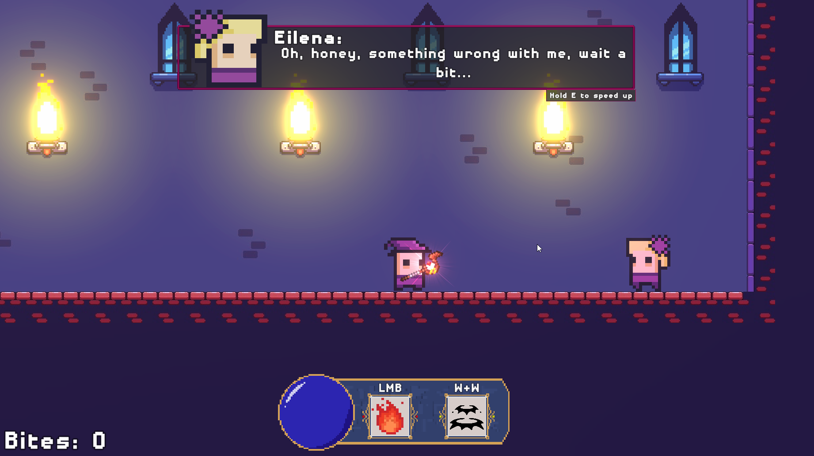
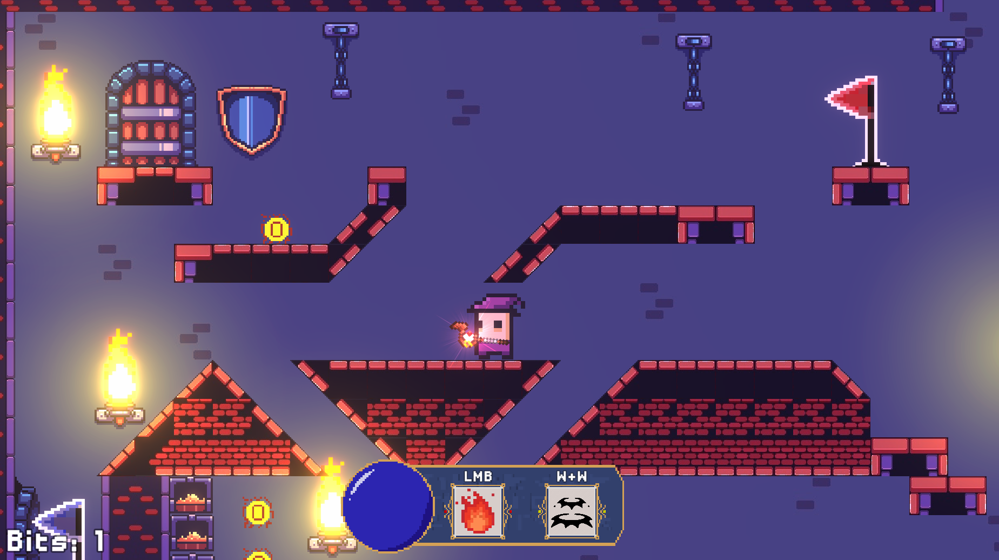
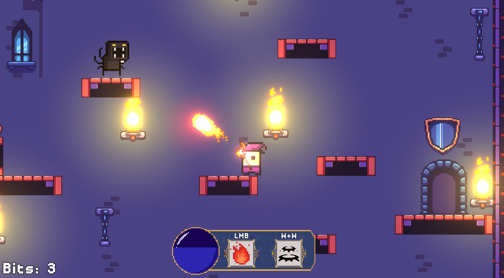
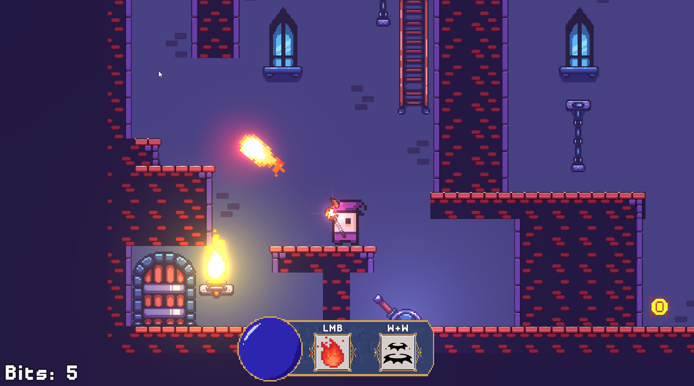
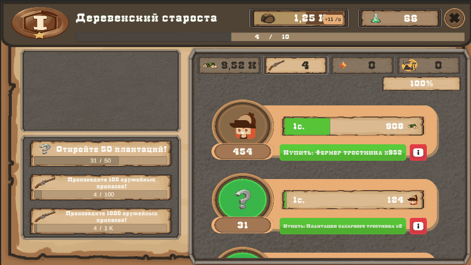
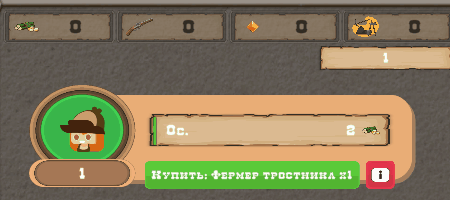
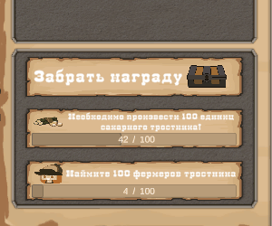
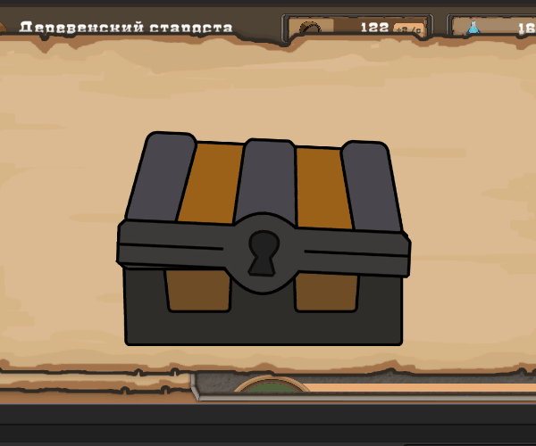
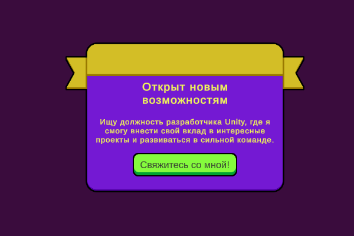

# Привет! Меня зовут Сергей

## Unity Developer | C# Programmer | Game Dev Enthusiast

**Email**: adel1z1511@gmail.com

---
### 🛠️ Мой стек технологий:  

- **Unity** (C#, UI, Animation, Sqlite, ScriptableObjects)  
- **C#** (ООП, SOLID, GRASP, Visual Studio)  
- **Паттерны** (Strategy, State, EntryPoint)
- **Version Control** (Git, GitHub)  
- **2D/3D** (Базовый уровень Aseprite, Adobe Illustrator)  
- **Дополнительно** (Знание алгоритмов, C++)  

---
### 💼 Опыт работы:  

- **НТП Криптософт** (16.11.2020 - по н. в.) – Специалист (Инженер-программист)  
	- **Разработка браузера** под Windows и внутреннюю ОС компании c использованием C# и Visual Studio;
	- **Разработка** и поддержка **кроссплатформенных приложений** с использованием C++ и фреймворка Qt;
	- **Создание UI/UX** для систем управления сертификатами: повысил удобство использования для пользователей и администраторов ОС Astra Linux;
	- Участие в полном цикле разработки: реализация новых функций, тестирование, отладка и исправление ошибок.
	- Сборка и запуск приложений под Windows и Linux.
	- Портирование и рефакторинг кода.
	- Написание технической документации.

---
### 🎮 Мои проекты:  

1. **I control my life, but...**
   - **Описание**: Небольшая игра-платформер, написанная в команде из 2 человек, для геймджема в 2020 году. 
   - **Вклад**: Я участвовал в разработке концепции игры, левел-дизайне, разработке механики врагов на одном из уровней, поиском и созданием ассетов для игры.
   - **Технологии**: Unity, C#, Aseprite.  
   - **Ссылка**: https://rabidusgames.itch.io/i-control-my-life-but

2. **Colonial Rush Idle** \[Prototype: WebGL\]
   - **Описание**: 2D Idle игра в сеттинге колонизации Нового Света. Игроку предстоит стать губернатором колонии, открывать и развивать производства и продвигаться по службе. 
   - **Технологии**: Unity (UI, Animation, Coroutine, ScriptableObjects), C#, Паттерны (State)
   - **Ссылка**: https://adel1z.itch.io/colonial-rush-idle

Последнее время itch.io работает с перебоями, поэтому ниже я оставлю несколько демо роликов:

**Основная сцена игры:**

  
  
  

---
### 🎓 Образование:  

- **ФГБОУ ВО Пензенский государственный университет** - 09.03.04 Программная инженерия (2018-2022)

---

### 🔧 Технические демо

## Пример 1: Popup окошко с использованием DOTween

**Технологии:** Unity, C#, DOTween, Unity UI.

**Цель:** Демонстрация навыков создания плавного, отзывчивого и визуально приятного интерфейса.

**Ключевые навыки:**
- Работа с системой Unity UI;
- Владение ассетом DOTween для создания сложных анимаций;
- Понимание принципов UX.

**Анимация появления:**

---

**Анимация исчезновения:**

---

**Анимация взаимодействия с кнопкой:**

---
### 📫 Контакты:

**Email**: adel1z1511@gmail.com
**Telegram**: @Adel1zL
**Habr Карьера**: https://career.habr.com/adeliz